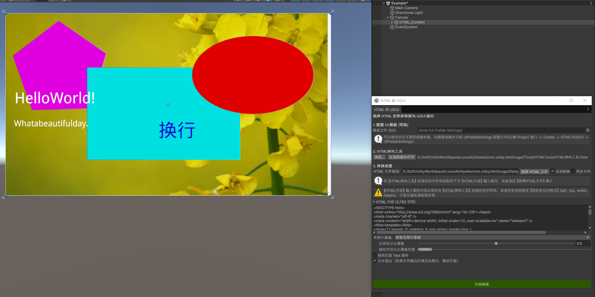

# 关于 HtmlToUGUI

使用 HtmlToUGUI 包在 Unity 编辑器中，将 HTML + CSS 内容转换为 UGUI（Canvas）层级结构。该包解析嵌入的 `<style>` 标签和行内样式，构建 CSS 级联，并将样式化的 HTML 结构映射为 UGUI GameObject（RectTransform、Image、TextMeshPro 文本、Button、InputField、Toggle、Slider、Dropdown、ScrollView）。

该包还提供了可从 Project 窗口右键菜单访问的 SpriteAtlas 工具。

## 安装

通过 Unity Package Manager 安装：

1. 打开 **Window → Package Manager**
2. 点击 **+** 按钮 → **Add package from git URL**（本地包可选择 Add by name）
3. 如果包包含 Samples，可在 Package Manager 窗口中导入

## 快速上手

1. 打开转换窗口：**Tools → HTML to UGUI Converter**
2. （可选）配置 UI 模板：创建 `UiPrefabSettings` 资源（**Assets → Create → HTMLToUGUI → UiPrefabSettings**），为各组件类型指定预制体
3. 加载 HTML 内容：
   - 将预处理后的 HTML 粘贴到文本区域；或
   - 点击 **选择 HTML 文件** 加载 `.html` 文件
4. 配置转换设置：

   | 设置项 | 说明 |
   |---|---|
   | 布局计算器 | 智能/全拉伸/居中 — 影响绝对定位元素到 RectTransform 锚点的映射方式 |
   | 旧版 Text 组件 | 使用 Unity 旧版 `Text` 组件代替 `TextMeshProUGUI` |
   | 文本溢出 | 启用后可防止单行文本自动换行 |
   | 自动转换 | 选择新文件后自动触发转换 |
   | 同步文件 | 监视 HTML 文件变更，自动重新转换 |

5. 点击 **开始转换**

生成的层级结构出现在场景的 `Canvas` 对象下（或复用场景中已有的 Canvas）。

> **提示 — AI 生成 HTML：** 如果想一步到位，不借助「HTML解构工具」转换，可在请求大语言模型生成 HTML 时附加 `Tools/HTMLTools/AI生成HTML提示词/` 目录下的提示词文件：
> - **SKILL_动态定位**（推荐，输出效果好）
> - **SKILL_绝对定位**（若 AI 足够听话，可直接输出可转换的 HTML）

有关 HTML 解构工具的详细使用教程、三种使用方式和 CORS 代理说明，请查看 [HTML解构工具使用教程](../Tools/HTMLTools/HTML解构工具使用教程.md)。

## 布局计算器

三种 `LayoutCalculator` 实现控制 `data-u-left/top/width/height` 属性到 UGUI 锚点和偏移的转换方式：

| 计算器 | 行为 |
|---|---|
| 智能（默认） | 检测元素应拉伸填满、贴边还是居中 — 基于可配置的阈值 |
| 全拉伸 | 将元素包围盒直接映射为百分比锚点 min/max |
| 居中 | 将元素置于父容器中心，不拉伸 |

智能计算器的阈值可在转换窗口的「布局计算器」下调整。

## SpriteAtlas 工具

在 Project 窗口中选中 **SpriteAtlas** 或 **Sprite(Multiple)** 资源，右键 → **Assets → HTMLToUGUI → 2D**：

| 菜单项 | 说明 |
|---|---|
| SpriteAtlas → TMP_SpriteAsset | 将图集导出为 TextMeshPro SpriteAsset（`.asset`），包含字形表和字符表 |
| SpriteAtlas → Sprite(Multiple) | 将图集导出为 Multiple 模式的精灵表 `.png` |
| SpriteAtlas → TextureSheet | 将图集中所有精灵打包为单张网格纹理 |
| Sprite(Multiple) → Sprites | 将 Multiple 模式的精灵纹理切分为独立的单模式 `.png` 文件 |

需要安装 `com.unity.2d.sprite` 包。**Project Settings → SpriteAtlas** 中必须启用 SpriteAtlas 功能。

## 竞品对比

本工具是一种轻量级的专用方案，将 AI 生成或手写的 HTML 内容转换为原生 UGUI 层级 — 非常适合快速 UI 原型开发。

| 方案 | 优点 | 缺点 |
|---|---|---|
| **HtmlToUGUI** | 完整 CSS 引擎（选择器/伪类/变量/级联）；直接输出 UGUI，运行时零开销；可插拔标签处理器；三种布局计算器；SpriteAtlas 转换工具 | 仅编辑期（无运行时 HTML 渲染）；HTML 输入需经捆绑工具预处理；限于绝对/相对定位 |
| [UI Toolkit](https://docs.unity3d.com/Manual/UIElements.html)（Unity 官方） | 深度 Unity 集成；USS 支持类 CSS 样式；运行时和编辑器双模式；构建支持 | 输出到自有渲染器（非 UGUI）；USS 是 CSS 子集 — 无 `var()`、伪类有限、布局模型不同；已有 UGUI 项目迁移成本高 |
| [Vuplex 3D WebView](https://developer.vuplex.com/) | 完整浏览器级 HTML/CSS/JS；可在 3D/UI 中实时渲染网页；跨平台 | 运行时重依赖（内嵌 Chromium）；输出为纹理，非交互式 UGUI；内存/CPU 成本高；需付费授权 |
| [UniWebView](https://uniwebview.com/) | 移动端原生 WebView 叠加；完整 HTML/CSS/JS；维护良好 | 仅移动端（iOS/Android）；浏览器引擎开销；以叠加层渲染，未集成到 UGUI 层级；需付费授权 |

**HtmlToUGUI 的核心优势**：输出为标准 UGUI 层级，无缝兼容 Unity 输入系统、预制体、射线检测和导航 — 无额外运行时依赖，无构建体积膨胀。

> **提示 — 设计稿转 UGUI 工作流：**
> 主流设计工具的文件可通过 HTML 中间步骤转换为 UGUI：
>
> | 工具 | HTML 导出方式 |
> |---|---|
> | **Figma** | 插件如 [Figma to HTML](https://www.figma.com/community/plugin/)、[Anima](https://www.animaapp.com/)，或内置 Dev Mode → CSS/HTML |
> | **Sketch** | [Anima](https://www.animaapp.com/)、Sketch2React，或手动导出 HTML |
> | **Adobe XD** | 插件如 Web Export，或 [Export Kit](https://exportkit.com/) |
> | **Photoshop** | 内置 **文件 → 导出 → HTML**，或 [psd2code](https://psd2code.com/) 等工具 |
> | **AI 生成** | 大语言模型直接输出 HTML，即可投入转换 |
>
> 从以上任一方式获取 HTML 后，通过本工具的转换管线处理，即可生成原生 UGUI 层级。

## 技术细节

### 环境要求

- Unity 2019.4.26f1 或更高版本
- `com.unity.textmeshpro`（自动安装）
- `com.unity.2d.sprite`（自动安装）
- HtmlAgilityPack（捆绑在包中）

### 已知限制

- HTML 输入必须经过预处理：每个元素必须携带 `data-u-left/top/width/height` 属性（绝对定位），或者 HTML 必须经过捆绑的「HTML解构工具」（位于 `Tools/HTMLTools/`）处理
- 图片路径必须指向 `Assets/` 或 `Packages/` 目录内的文件
- 圆角（border-radius）尚未渲染，仅通过 `Outline` 组件实现简单边框
- `<a>` 标签的超链接点击事件尚未接入
- CSS `display: flex` / `grid` 布局未模拟，仅支持绝对定位和相对定位

### 包内容

| 位置 | 说明 |
|---|---|
| `Editor/` | 转换窗口、元素工厂、资源加载器、文件监视器、SpriteAtlas 工具 |
| `Runtime/` | CSS 解析器、布局计算器、标签处理器、样式应用器、数据模型（可在运行时使用） |
| `Samples/Example/` | 示例场景，包含 HTML 文件和精灵图集 |
| `Tools/HTMLTools/` | 预处理工具和辅助脚本 |
| `Documentation/` | 本文档 |

## 文档修订历史

| 日期 | 说明 |
|---|---|
| 2026-05-18 | 初始发布 |